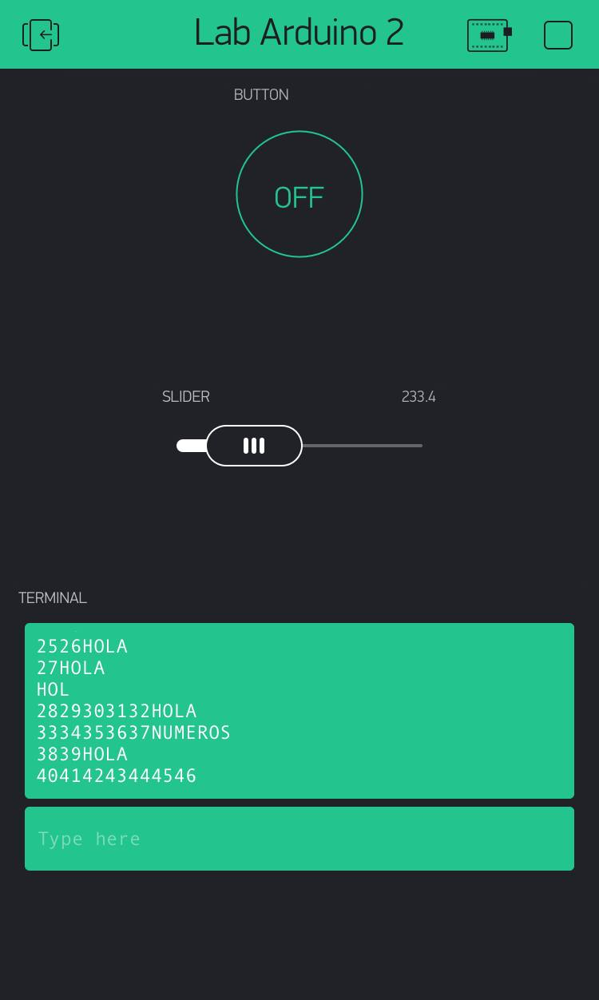

Name: Erick Isaac Cortez Valdez

EID: eic366

Team Number: 14

## Questions

1. What is the purpose of an IP address?

    Is the 'digital' address of a machine with capacity to connect to the internet and is used as an identifier for that machine

2. What is a DNS? What are the benefits of using domain names instead of IP addresses?

    A DNS converts the 'friendly' name of a website into the corresponding IP address. We use domain addresses because they are much easier to remember for humans compared to IP addresses. 

3. What is the difference between a static IP and a dynamic IP?

    A static IP address doesn't change with time while a dynamic IP does change over time.

4. What is the tradeoff between UDP and TCP protocols?

    TCP is more reliable because it provides error checking and the delivery of the data, while UDP is faster because it doesn't provide extensive error checking. 

5. Why can't we use the delay function with Blynk?

    Because Blynk is event based, meaning that if we have a delay and an event happens, the events wouldn' be read and the timing would break. 

6. What does it mean for a function to be "Blocking"?

    It means that while the function is running, nothing else can run. 

7. Why are interrupts useful for writing Non-Blocking code?

   Because whenever a new function with higher priority that the current one interrupts, the program takes the interrupt. Basically by having interrupts we ensure that functions do not take up time that other may need. 

8. What is the difference between interface and implementation? Why is it important?

   Interface defines how a function is called while the implementantion is what the function actually does.

9. Screenshot of your Blynk App:

    
